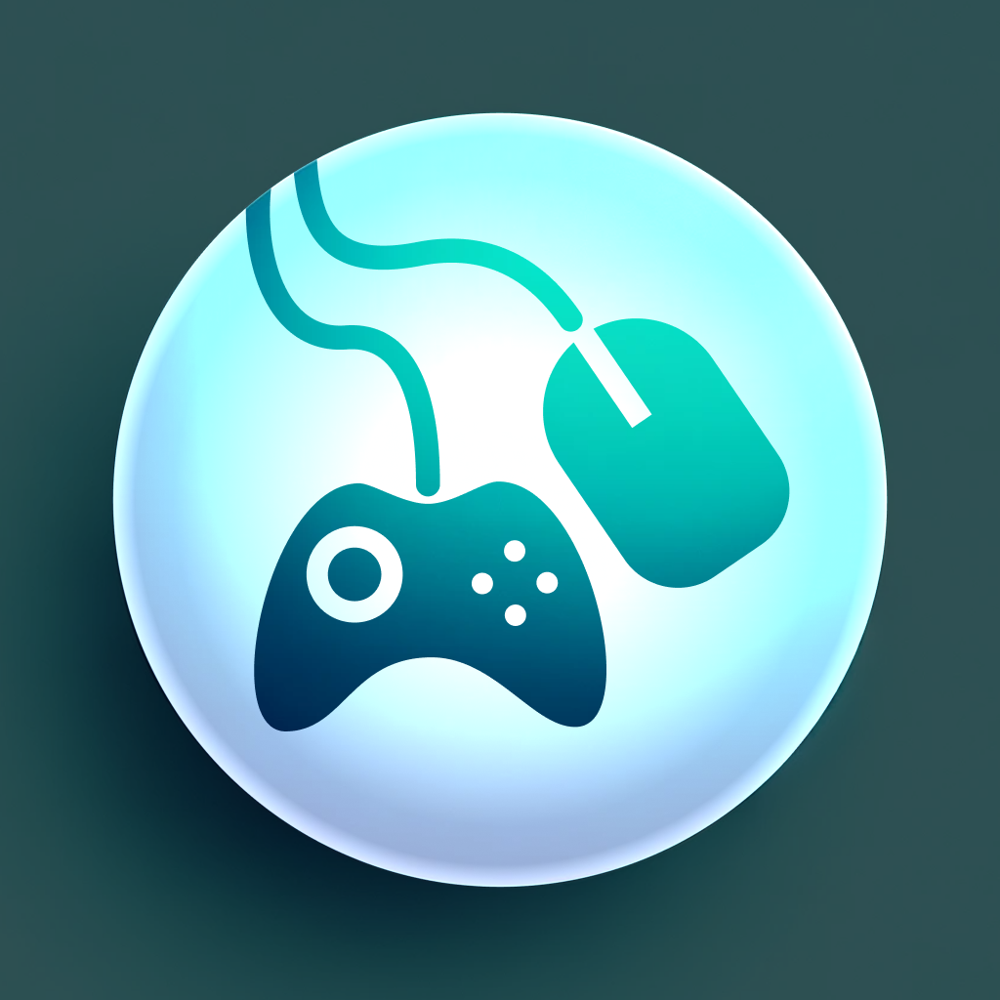

<br>
# Better Input Manager
<i>An improved input manager</i> <br>
### Version 2.0.1.1

[](https://github.com/skymen/better-input-manager-sdkv2/releases/download/skymen_better_input_manager-2.0.1.1.c3addon/skymen_better_input_manager-2.0.1.1.c3addon)
<br>
<sub> [See all releases](https://github.com/skymen/better-input-manager-sdkv2/releases) </sub> <br>

#### What's New in 2.0.1.1
**Fixed:**
Set Axis and Set Joystick from Inputs now correctly read the inputs only from the control scheme they are writing to

<sub>[View full changelog](#changelog)</sub>

---
<b><u>Author:</u></b> skymen <br>
<sub>Made using [CAW](https://marketplace.visualstudio.com/items?itemName=skymen.caw) </sub><br>

## Table of Contents
- [Usage](#usage)
- [Examples Files](#examples-files)
- [Properties](#properties)
- [Actions](#actions)
- [Conditions](#conditions)
- [Expressions](#expressions)
---
## Usage
To build the addon, run the following commands:

```
npm i
npm run build
```

To run the dev server, run

```
npm i
npm run dev
```

## Examples Files
| Description | Download |
| --- | --- |
| better-input-manager-demo | [](https://github.com/skymen/better-input-manager-sdkv2/raw/refs/heads/main/examples/better-input-manager-demo.c3p) |

---
## Properties
| Property Name | Description | Type |
| --- | --- | --- |
| Default Axis Deadzone | A value between 0 and 1 that determines the default deadzone for all axes | float |
| Default Joystick Deadzone | A value between 0 and 1 that determines the default deadzone for all joysticks | float |
| Default Control Scheme | The default control scheme to use | text |
| Auto Switch Control Scheme | Whether to automatically switch control schemes when the user inputs a new control scheme | check |


---
## Actions
| Action | Description | Params
| --- | --- | --- |
| Set Axis Deadzone | Set the deadzone for an axis | Name             *(string)* <br>Deadzone             *(number)* <br> |
| Set Axis From Inputs | Set an axis value from two digital inputs (positive - negative) | Name             *(string)* <br>Negative Input             *(string)* <br>Positive Input             *(string)* <br>Player             *(number)* <br>Control Scheme             *(string)* <br>Prevent Auto Switch             *(boolean)* <br> |
| Set Axis Value | Set an axis to a value | Name             *(string)* <br>Value             *(number)* <br>Player             *(number)* <br>Control Scheme             *(string)* <br>Prevent Auto Switch             *(boolean)* <br> |
| Set Default Axis Deadzone | Set the default deadzone for all axes that don't have a custom deadzone set | Deadzone             *(number)* <br> |
| Set Default Joystick Deadzone | Set the default deadzone for all joysticks that don't have a custom deadzone set | Deadzone             *(number)* <br> |
| Set Joystick Deadzone | Set the deadzone for a joystick | Name             *(string)* <br>Deadzone             *(number)* <br> |
| Set Joystick From Inputs | Set a joystick value from four digital inputs (positive - negative per axis, normalized to length 1) | Name             *(string)* <br>X Negative             *(string)* <br>X Positive             *(string)* <br>Y Negative             *(string)* <br>Y Positive             *(string)* <br>Player             *(number)* <br>Control Scheme             *(string)* <br>Prevent Auto Switch             *(boolean)* <br> |
| Set Joystick Value | Set a joystick to a value | Name             *(string)* <br>X             *(number)* <br>Y             *(number)* <br>Player             *(number)* <br>Control Scheme             *(string)* <br>Prevent Auto Switch             *(boolean)* <br> |
| Set Joystick Value X | Set a joystick X value | Name             *(string)* <br>Value             *(number)* <br>Player             *(number)* <br>Control Scheme             *(string)* <br>Prevent Auto Switch             *(boolean)* <br> |
| Set Joystick Value Y | Set a joystick Y value | Name             *(string)* <br>Value             *(number)* <br>Player             *(number)* <br>Control Scheme             *(string)* <br>Prevent Auto Switch             *(boolean)* <br> |
| Set Auto Switch Control Scheme | Enable or disable auto switch | Player             *(number)* <br>Enabled             *(boolean)* <br> |
| Set Control Scheme | Switch to a control scheme | Control Scheme             *(string)* <br>Player             *(number)* <br> |
| Set Down Input | Set an input to a down state | Name             *(string)* <br>Player             *(number)* <br>Control Scheme             *(string)* <br>Prevent Auto Switch             *(boolean)* <br> |
| Set Up Input | Set an input to an up state | Name             *(string)* <br>Player             *(number)* <br>Control Scheme             *(string)* <br> |
| Simulate Down Input | This only triggers the down event, it does not set the input to a down state | Name             *(string)* <br>Player             *(number)* <br> |
| Simulate Up Input | This only triggers the up event, it does not set the input to an up state | Name             *(string)* <br>Player             *(number)* <br> |
| Map Wire To Player | Map a wire to a player | Name             *(string)* <br>Player             *(number)* <br> |


---
## Conditions
| Condition | Description | Params
| --- | --- | --- |
| Is Any Axis Outside Deadzone | Test if any axis is outside its deadzone | Player *(number)* <br> |
| Is Any Axis Outside Deadzone For Control Scheme | Test if any axis is outside its deadzone for a control scheme | Player *(number)* <br>Control Scheme *(string)* <br> |
| Is Any Joystick Outside Deadzone | Test if any joystick is outside its deadzone | Player *(number)* <br> |
| Is Any Joystick Outside Deadzone For Control Scheme | Test if any joystick is outside its deadzone for a control scheme | Player *(number)* <br>Control Scheme *(string)* <br> |
| Is Axis Outside Deadzone | Test if an axis is outside its deadzone | Name *(string)* <br>Player *(number)* <br> |
| Is Axis Outside Deadzone For Control Scheme | Test if an axis is outside its deadzone for a control scheme | Name *(string)* <br>Player *(number)* <br>Control Scheme *(string)* <br> |
| Is Joystick Outside Deadzone | Test if a joystick is outside its deadzone | Name *(string)* <br>Player *(number)* <br> |
| Is Joystick Outside Deadzone For Control Scheme | Test if a joystick is outside its deadzone for a control scheme | Name *(string)* <br>Player *(number)* <br>Control Scheme *(string)* <br> |
| Is Control Scheme Enabled | Test if a control scheme is enabled | Name *(string)* <br>Player *(number)* <br> |
| Is Any Down | Test if any input is down | Player *(number)* <br> |
| Is Any Down For Control Scheme | Test if any input is down for a specific control scheme | Player *(number)* <br>Control Scheme *(string)* <br> |
| Is Down | Test if an input is down | Name *(string)* <br>Player *(number)* <br> |
| Is Down For Control Scheme | Test if an input is down for a specific control scheme | Name *(string)* <br>Player *(number)* <br>Control Scheme *(string)* <br> |
| On Any Down | Trigger an event when any input is pressed down | Player *(number)* <br> |
| On Any Up | Trigger an event when any input is released | Player *(number)* <br> |
| On Down | Trigger an event when an input is pressed down | Name *(string)* <br>Player *(number)* <br> |
| On Up | Trigger an event when an input is released | Name *(string)* <br>Player *(number)* <br> |


---
## Expressions
| Expression | Description | Return Type | Params
| --- | --- | --- | --- |
| GetAxis | Get the value of an axis | number | Name *(string)* <br>Player *(number)* <br> | 
| GetJoystickAngle | Get the angle of a joystick | number | Name *(string)* <br>Player *(number)* <br> | 
| GetJoystickMagnitude | Get the magnitude of a joystick | number | Name *(string)* <br>Player *(number)* <br> | 
| GetJoystickX | Get the x value of a joystick | number | Name *(string)* <br>Player *(number)* <br> | 
| GetJoystickY | Get the y value of a joystick | number | Name *(string)* <br>Player *(number)* <br> | 
| GetRawAxis | Get the raw value of an axis | number | Name *(string)* <br>Player *(number)* <br> | 
| GetRawJoystickMagnitude | Get the raw magnitude of a joystick | number | Name *(string)* <br>Player *(number)* <br> | 
| GetRawJoystickX | Get the raw x value of a joystick | number | Name *(string)* <br>Player *(number)* <br> | 
| GetRawJoystickY | Get the raw y value of a joystick | number | Name *(string)* <br>Player *(number)* <br> | 
| GetControlScheme | Get the name of the current control scheme | string | Player *(number)* <br> | 
| IsDown | Get whether an input is down (1) or up (0) | number | Name *(string)* <br>Player *(number)* <br> | 
| LastInput | Get the name of the last input from trigger | string |  | 
| LastPlayer | Get the ID of the last player from trigger | number |  | 
| WireFrom | Wire a control scheme to a player using an id | number | Name *(string)* <br> | 


---
## Changelog

### Version 2.0.1.1

**Fixed:**
Set Axis and Set Joystick from Inputs now correctly read the inputs only from the control scheme they are writing to
---

### Version 2.0.1.0

**Added:**
Set Axis From Input
Set Joystick From Input
IsDown expression

---

### Version 2.0.0.0

**Added:**
Ported to SDK V2

---

### Version 0.0.0.0

**Added:**
Initial release.

---
